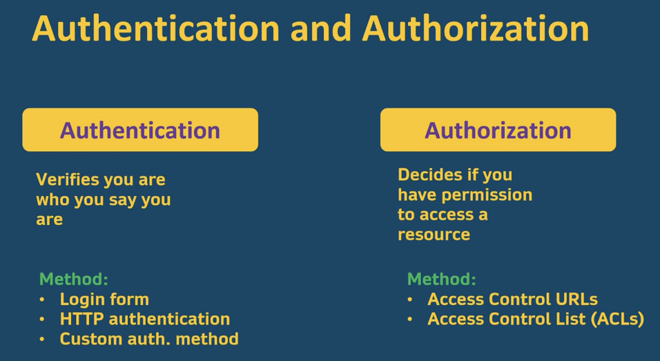
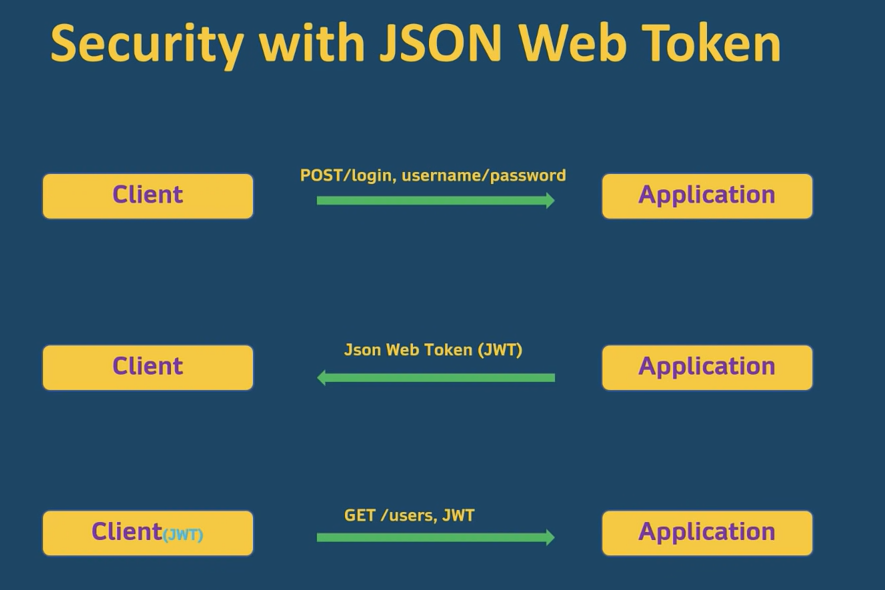

= Good to know

== Authentication and Authorization

they are kind of related, but not the same!

Authentication is verifying who you are, and makes sure you are who you say you are, and let you in to the application.

Authorization: can u access this specific resource on the application?

JSON Web Token is used for authentication! We verify with token, makes sure that token is valid, and get all the permission on that token for that specific user, and that is authorization.

Authentication verifies you, and authorization determined if you can access specific resource on the server.

'''

== SECURITY with JSON WEB TOKEN

You can give to the client a refresh token, when the first one expires!

For MAVEN dependency:

https://mvnrepository.com/artifact/com.auth0/java-jwt

Gradle:

https://mvnrepository.com/artifact/com.auth0/java-jwt/3.19.2

Gradle and maven dependency:

https://simplesolution.dev/java-json-web-token-using-java-jwt-library/

'''

Login test in postman:

because of request.getParameter("username") & request.getParameter("password") in body we use: x-www-form-urlencoded

typing the key and value:

image::../../git-practice-greenfox/doc/image-2022-06-19-20-07-19-849.png[]

in the Headers we can see access and refresh token:

image::../../git-practice-greenfox/doc/image-2022-06-19-20-10-45-547.png[]

when we have the token:

https://jwt.io/

copy the token, paste it here:

image::../../git-practice-greenfox/doc/image-2022-06-19-20-14-25-834.png[]

and then we can check refresh token the same way:

image::../../git-practice-greenfox/doc/image-2022-06-19-20-16-10-001.png[]

Because of this refactor in CustomAuthenticationFilter:

image::../../git-practice-greenfox/doc/image-2022-06-19-20-56-02-871.png[]

the result is as follows (much nicer format!):

image::../../git-practice-greenfox/doc/image-2022-06-19-20-56-57-101.png[]

CustomAuthenticationFilter customAuthenticationFilter = new CustomAuthenticationFilter(authenticationManagerBean());

customAuthenticationFilter.setFilterProcessesUrl("/api/login");
this overrides, and that reason new postman request as follows:

image::../../git-practice-greenfox/doc/image-2022-06-19-21-11-18-694.png[]

Order:

- first I put what I want to permit.
- then separated different permissions for roles.
- the end: the authenticated!

